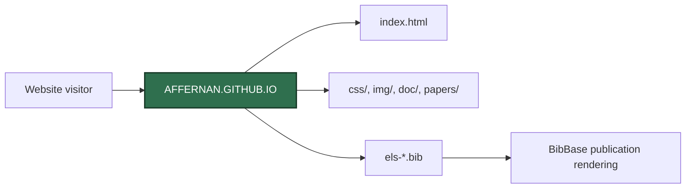

<p align="center">
  <strong>AFFERNAN.GITHUB.IO</strong><br />
  Static academic website for Alejandro Fernandez Gil.
</p>

<p align="center">
  
  
  
</p>

<p align="center">
  <code>Academic Website</code> | <code>HTML</code> | <code>CSS</code> | <code>BibTeX</code> | <code>GitHub Pages</code>
</p>

---

`affernan.github.io` packages the source files for the academic website published at `https://affernan.github.io/`. The site presents research interests, publications, teaching, projects, and academic profile information.

The repository is a static website. It does not include a backend service, build pipeline, package manager, or server-side application code.

## Product Surface

| Area | Contract |
| --- | --- |
| Runtime | Static HTML, CSS, images, PDF documents, and BibTeX files |
| UI | `index.html` published through GitHub Pages |
| Data path | Browser loads static assets and BibBase publication scripts |
| Storage | Git-tracked website assets |
| Documentation | This README |
| Distribution | GitHub Pages from the repository default branch |

## Runtime Shape



## Responsibilities

- Serve the public academic website through GitHub Pages.
- Present profile, research, projects, publications, and teaching information.
- Store static images, documents, paper files, and bibliographic files used by the site.
- Provide indexing metadata through `robots.txt` and `sitemap.xml`.
- Avoid committing private documents or credentials.

## How It Is Built

| File / Folder | Role |
| --- | --- |
| `index.html` | Main single-page website. |
| `css/` | Stylesheet resources. |
| `img/` | Website images and profile/media assets. |
| `doc/` | Public documents linked from the site. |
| `papers/` | Paper-related files made available through the website. |
| `els-conf.bib` | Conference publication bibliography used by the site. |
| `els-journals.bib` | Journal publication bibliography used by the site. |
| `robots.txt` | Search engine crawler instructions. |
| `sitemap.xml` | Site indexing metadata. |

## Platform and Service Dependencies

<table>
  <tr>
    <th>Service / Object</th>
    <th>Provider</th>
    <th>Usage</th>
    <th>Purpose</th>
  </tr>
  <tr>
    <td><code>GitHub Pages</code></td>
    <td>GitHub</td>
    <td>Publishes the static repository as a website.</td>
    <td>Hosts the public academic site.</td>
  </tr>
  <tr>
    <td><code>BibBase</code></td>
    <td>BibBase</td>
    <td>Renders publication lists from the repository BibTeX files.</td>
    <td>Keeps publication content driven by bibliography data.</td>
  </tr>
</table>

## Local Development

This is a static site. Preview it by opening `index.html` in a browser or by serving the repository with a local static file server:

```bash
python -m http.server 8000
```

## Build And Serve

No build step is defined. GitHub Pages serves the committed static files.

## Verification

No automated tests are defined. Recommended manual checks are:

- Open `index.html` locally.
- Confirm image and document links resolve.
- Confirm BibBase publication sections load from the `.bib` files.
- Confirm `robots.txt` and `sitemap.xml` reference the expected public URL.

## Secret Handling

This repository is public website content. Do not commit private documents, unpublished confidential papers, credentials, or personal data that should not be indexed.
